# 782-张苏皖新娘派对装饰产品图片文档

产品信息：新娘派对装饰品  
【纸灯笼（墨绿色1pcs、土金色1pcs）

纸花（鼠尾草绿3pcs、米黄色2pcs、金色波点2pcs）

纸扇（25cm米黄色2pcs、30cm米黄色1pcs、30cm绿色波点1pcs）

纸流苏（墨绿色5pcs、卡其色5pcs、米黄色5pcs、铝箔金色5pcs）

气球（墨绿色10pcs、米黄色4pcs、铝箔金色4pcs、金色波点4pcs）

哑光绿雨丝帘2pcs、头纱1pcs、绶带1pcs、拉旗1pcs

钻石戒指气球1pcs+一根吸管，为一套】

尺寸要求：1600

优质卖家参考链接：https://www.amazon.com/Decorations-Bachelorette-Party-Backdrop-Engagement/dp/B0DJW2NVZ9/

https://www.amazon.com/LFSTGN-Bridal-Shower-Decorations-Bachelorette/dp/B0DGLMZKHW/

---

## 第一张：首图（ST）

**样图1：**
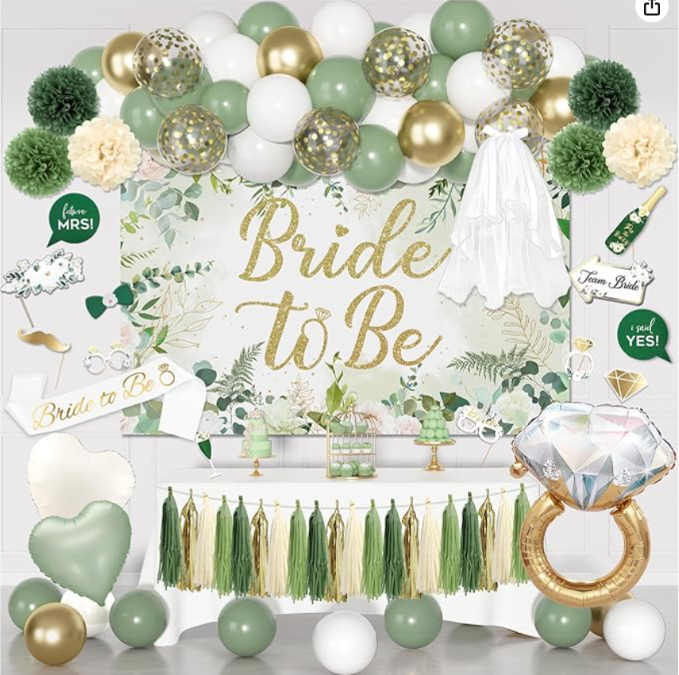

**样图2：**
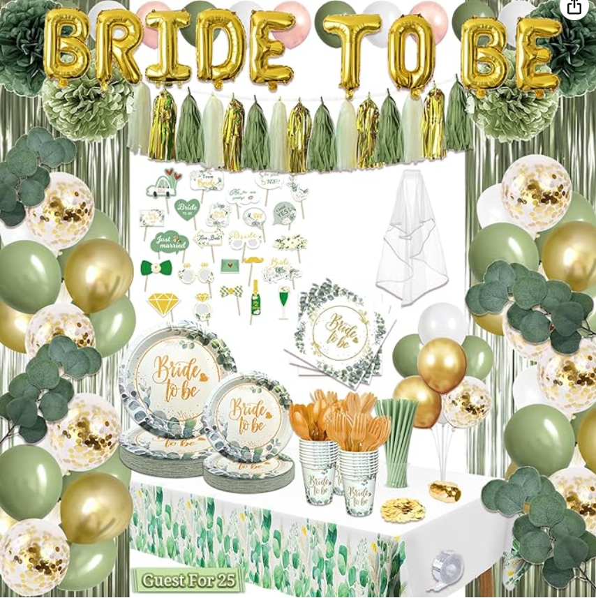

**摄影：** 参考样图2，拍摄两张雨丝帘挂起来的图片，中间留白比样图2小一点；拍摄一张弯曲程度如样图2中流苏弯曲程度差不多的圆片和bride to be拉旗，圆片拉旗在上；拍摄一张所有气球和纸花纸扇位置错乱的如样图1纸灯笼一左一右放一个，纸花可以绑在气球中间，就是颜色错乱一点；最左边是绿色波点和米黄色纸扇，最右边是米黄色一大一小两个，纸流苏四种颜色，从左往右墨绿、卡其、金铝箔、米黄排列，拍摄一张绑在桌子前的照片，如样图1；拍摄一张头纱展开饱满的图片；拍摄一张戒指气球吹好气的正面照；拍摄一张绶带如样图1弯叠的图片

**美工：** 将摄影师所给图片修饰美化，参考样图1的排版制作主图，背景颜色白底图，雨丝帘中间留白减少一点，最上面是气球，两条拉旗在气球下面，圆片拉旗在上，两侧可以摆上一些散落的气球，钻石戒指放在左下角的位置，头纱放在右边帘子中间，绶带放头纱上面，桌子放中间，桌布颜色为米白色，桌子上那个可以p一点点心，马卡龙、小蛋糕之类的

---

## 第二张：颜色数量图

**样图3：**
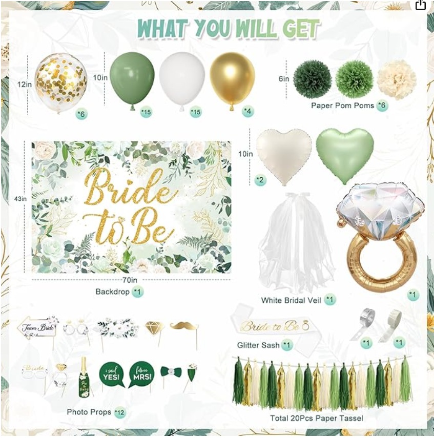

**样图4：**
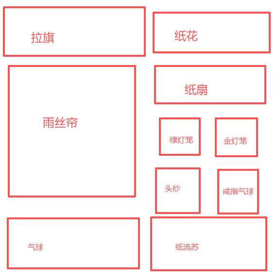

**摄影：** 参考样图3，分别拍四种颜色的气球的正面，三种颜色纸花的正面，三种颜色的纸扇的正面还有两种颜色的纸灯笼；拍摄两张雨丝帘拼在一起的图片

**美工：** 将摄影师所给图片修饰美化，主要参考样图4的排版，尺寸也要标注在旁边

图片最上方文案PACKAGE INCLUDE绿底白字花体

【标注：

- 纸灯笼下标注 Paper Lanterns\*2 — 尺寸标注 25cm/9.8in
- 纸花下标注 Paper Pom Poms\*7 — 尺寸标注 鼠尾草绿、米黄色直径 25cm/9.8in，金色波点 20cm/7.9in
- 纸扇下标注 Paper Fans\*4 — 尺寸标注 25cm/9.8in米黄色，30cm/11.8in米黄色、绿色波点
- 纸流苏下标注 Total 20Pcs Paper Tassel — 尺寸标注 长35cm/13.8in
- 气球下标注 Latex Balloons\*16 — 尺寸标注 25cm/10in
- 哑光绿雨丝帘下标注 Fringe Curtain\*2 — 尺寸标注 100\*200cm/39.3\*78.4in
- 头纱下标注 White Bridal Veil\*1 — 尺寸标注 60\*80cm/24\*32in
- 绶带下标注 Glitter Sash\*1 — 尺寸标注 9.5\*79cm
- 拉旗下标注 Circle Dot Garlands\*1、"BRIDE TO BE" Banner\*1 — 尺寸标注 200cm/78.4in
- 钻石戒指气球下标注 Foil Balloons\*1 — 尺寸标注 60\*65cm/24\*26in】

---

## 第三张：细节图（XJT）

**样图5：**
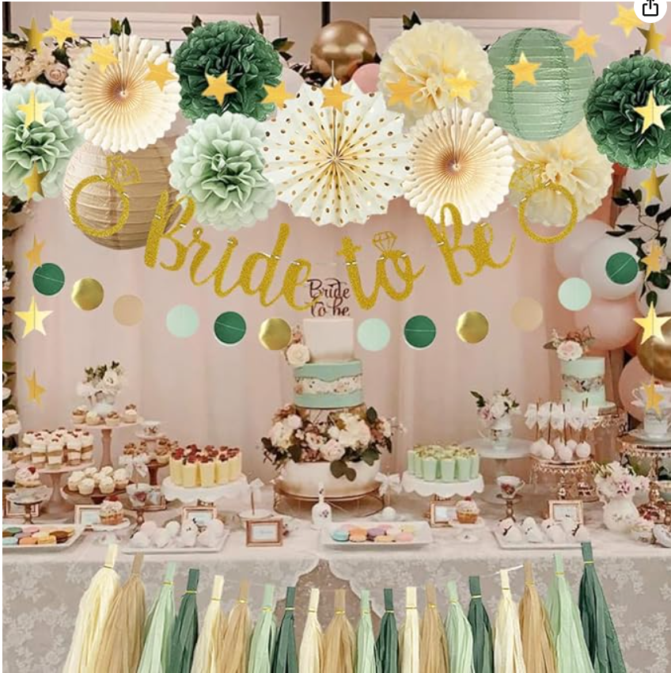

**样图6：**
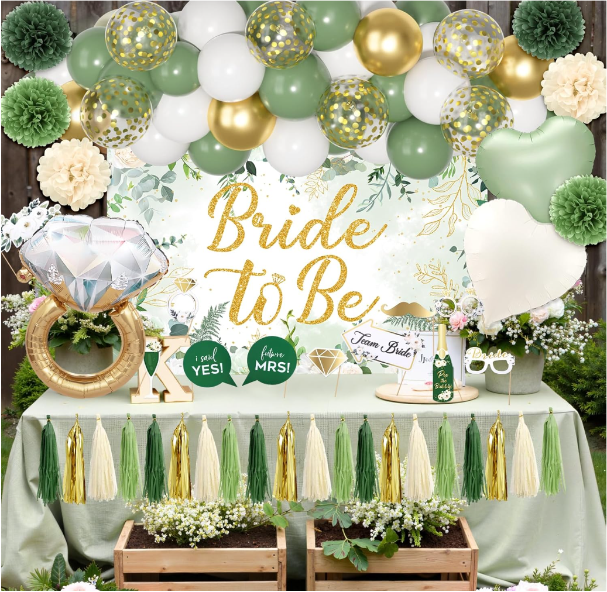

**美工：** 参考样图5的排版桌布换成米白色，后面粉色的背景换成拼在一起的雨丝帘，把气球和纸花纸扇这些按样图4放大一点点，食物摆满桌子，纸流苏拉直绑在桌子前，效果参考样图6

---

## 第四张：使用图（SYT）

**样图7：**
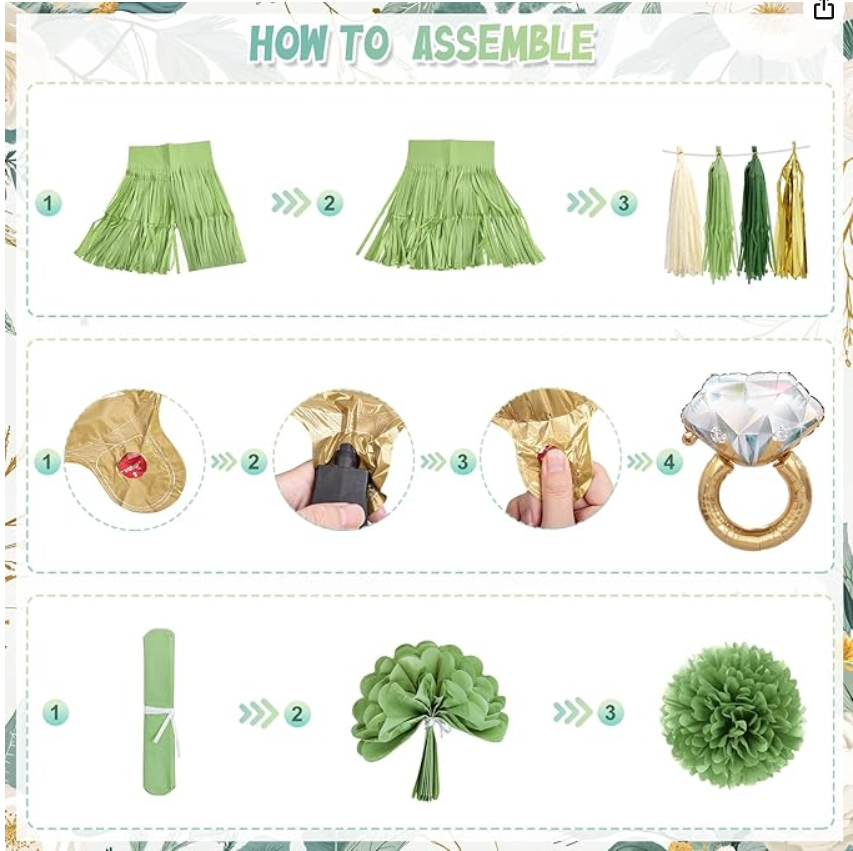

**样图8：**
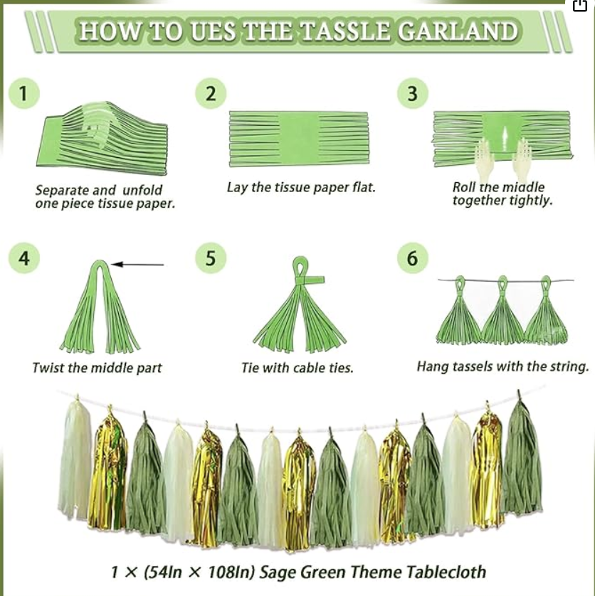

**摄影：** 参考样图7每一步都拍一张，纸流苏的步骤参考样图8的1、3、5；气球和纸花都参考样图6

**美工：** 参考样图7的排版，文案：HOW TO ASSEMBLE放在图片最上面，不要箭头，只要给步骤标序，文案绿底白字花体

---

## 第五张：场景图1

**场景样图1：**
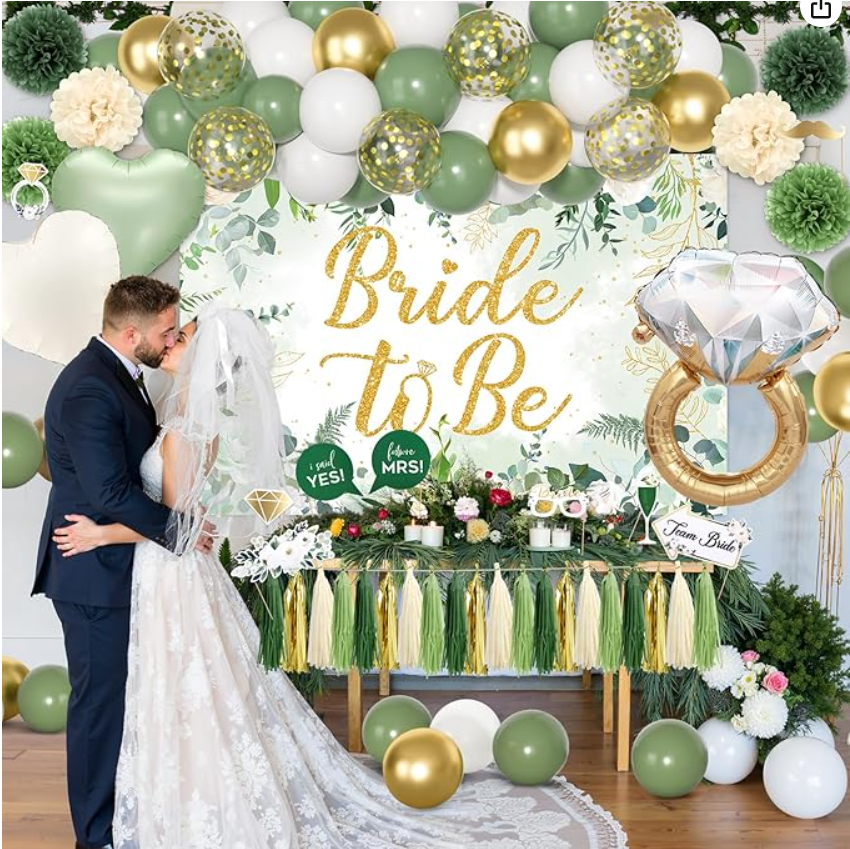

**美工：** 参考场景样图1，桌布换成米白色，桌子上放上小蛋糕，男生和女生参考素材，放在右边，女生带上头纱和绶带，钻石戒指气球p在桌子上面

**素材（情侣）：**
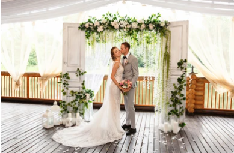

> 素材来源：https://www.shutterstock.com/zh/image-photo/wedding-couple-kissing-near-arch-after-1106083916

---

## 第六张：场景图2

**场景样图2：**
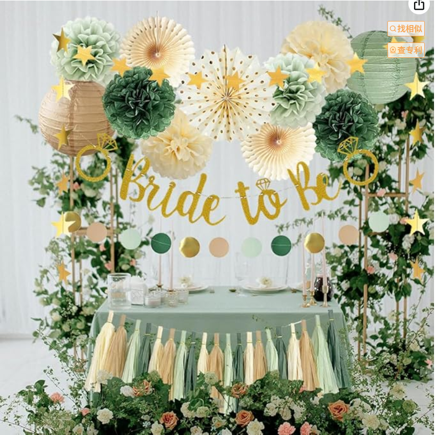

**美工：** 参考场景样图2，背景是雨丝帘，气球和纸花都在上面的架子上，旁边围上一些绿色植物，桌子前也p上一些绿色植物，镶嵌一些米黄色和玫红色的玫瑰，桌布换成米白色的，桌子上摆上一些酒杯

---

## 第七张：场景图3

**场景样图3：**
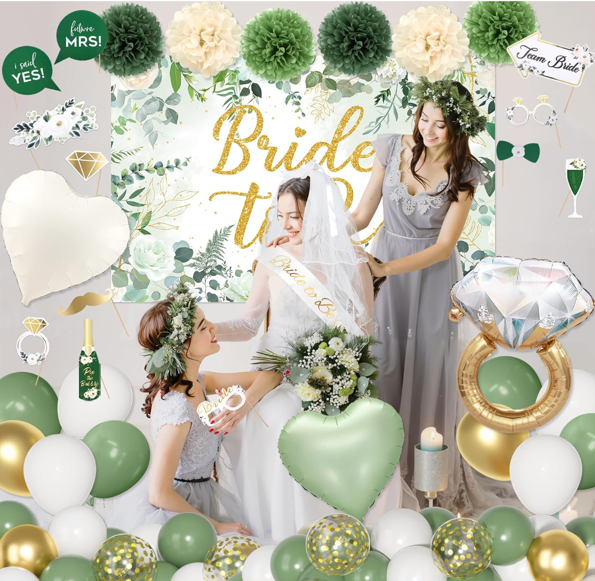

**美工：** 排版参考场景样图3，人物参考素材活泼生动一点，新娘是穿上婚纱戴着头纱和绶带的，气球和纸花都放在图片上面，背景是雨丝帘，钻石戒指气球p在旁边

**素材（姐妹团）：**

> 素材来源：https://www.shutterstock.com/zh/image-photo/group-four-young-adult-women-wearing-2685714251

---

> **来源：** 飞书文档 `NDledzeDQoKMSAxI3kQc4IwLnAg`  
> **导入时间：** 2026-06-10  
> **原始链接：** https://uikz7wcmjbd.feishu.cn/docx/NDledzeDQoKMSAxI3kQc4IwLnAg  
> **图片数量：** 13 张（已全部下载到本地）
