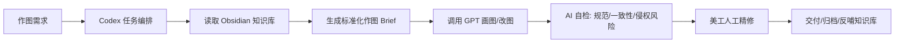

我建议你不要一上来做成“全自动 AI 美工流水线”。更稳的方案是：**先把 Obsidian 做成部门知识底座，Codex 做调度员，GPT 负责图像生成/改图，人类美工做最终质检和精修。**

你的目标不是“替代美工”，而是把美工从重复出图、套版、初稿探索里解放出来。这个判断很关键。

**我推荐的总体架构**

````

````

Obsidian 在这里不是“聊天工具”，而是**部门大脑**：存规范、模板、案例、作图 SOP、产品视觉规则、踩坑记录。

Codex 是**操作系统/项目经理**：负责读取知识库、拆任务、生成提示词、组织文件、记录结果。

GPT 图像模型是**生产工具**：负责出图、改图、生成多方案。

美工是**审美和风险负责人**：负责最终判断、修细节、保证产品真实和品牌一致。

---

我会建议你分三阶段做。

**第一阶段：先做“AI 作图助手”，不要急着自动化**

先让 Codex 根据 Obsidian 知识库帮美工生成：

- 标准作图 Brief
- 主图/A+图/广告图提示词
- 图片检查清单
- 合规风险提醒
- PSD/模板套版说明
- 修改意见转提示词

也就是先解决这个问题：

> 美工或运营给一个需求，Codex 能不能自动整理成 GPT 可以直接执行的高质量作图指令？

这一步最值钱，因为很多 AI 出图差，不是模型差，而是输入太乱。

---

**第二阶段：把你们已有资料结构化**

你手里这几类资料都很重要，但处理方式不同：

|资料类型|建议处理方式|
|---|---|
|以前的作图资料|做成“案例库”：好图为什么好、适合什么产品、用了什么构图|
|开发给美工的作图模板|做成“模板库”：尺寸、图层用途、适用场景、注意事项|
|亚马逊规范|放入 `wiki/standards/`，作为硬性检查标准|
|AI 作图文章/教程|放入 `wiki/concepts/` 和 `wiki/workflows/`，沉淀方法论|
|竞品图/优秀案例|放入 `raw/assets/`，再生成视觉分析页面|
|产品资料|建议后续建 `wiki/products/`，每个产品/品类一页|

我尤其建议你建立这三个核心库：

```
wiki/
├── standards/      ← 平台规范：主图、A+、广告尺寸、合规
├── templates/      ← 公司模板：PSD模板、A+模板、广告模板
├── cases/          ← 历史案例：优秀图、失败图、修改前后
├── workflows/      ← 工作流：AI出图流程、审核流程、归档流程
└── products/       ← 产品知识：卖点、材质、禁忌、视觉方向
```

你现在已经有 `standards/` 和 `workflows/`，下一步我会优先补 `templates/` 和 `cases/`。

---

**第三阶段：再做“半自动生产线”**

等知识库稳定后，再让 Codex 做这种流程：

1. 读取产品资料
2. 读取对应品类案例
3. 读取公司模板
4. 读取亚马逊规范
5. 自动生成 3 套作图方案
6. 调 GPT 生成图片
7. 自动生成检查报告
8. 美工选方案并精修
9. 把最终图和经验回写知识库

这个时候才适合说“把大部分任务交给 AI”。

---

我对你当前方案的判断是：

**方向是对的，但重心应该从“让 GPT 直接画图”调整为“让 Codex 帮 GPT 准确画图”。**

因为美工部门真正需要的不是随机好看的图，而是：

- 符合亚马逊规则
- 符合产品真实形态
- 符合品牌视觉
- 能复用公司模板
- 能稳定批量生产
- 出问题能追溯
- 美工接手能继续改

所以 Obsidian 知识库非常适合作为中间层。它不是多余的，反而是让 AI 画图稳定下来的关键。

我建议下一步就做一个很实用的东西：**《AI 作图任务标准输入表》**。以后运营/开发/美工给需求，都按这个表填，Codex 再根据知识库生成 GPT 作图提示词。这样你们部门会立刻感觉流程清楚很多。