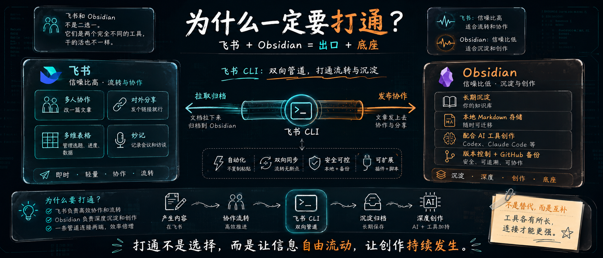
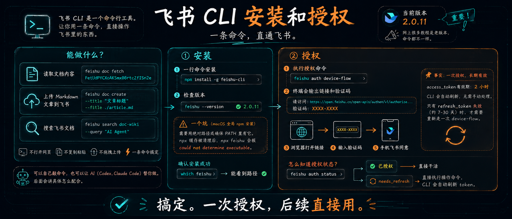
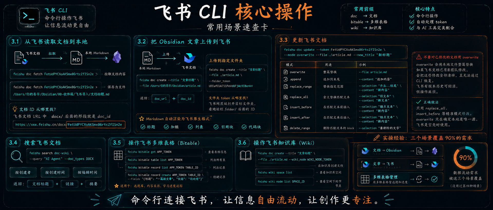
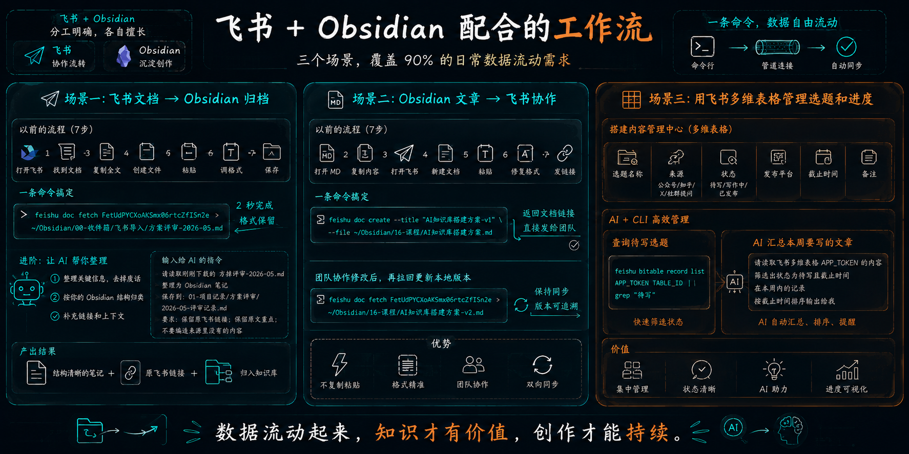
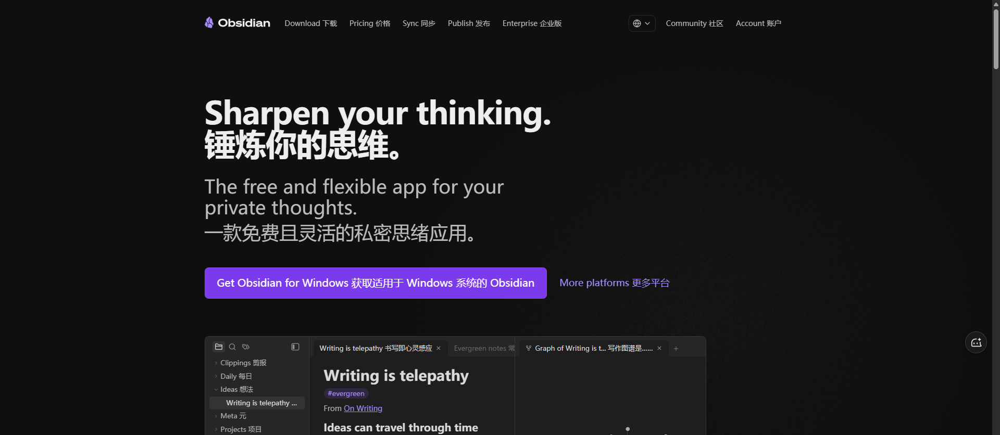
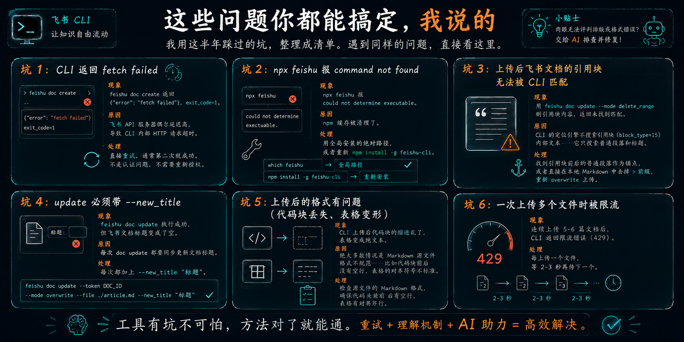
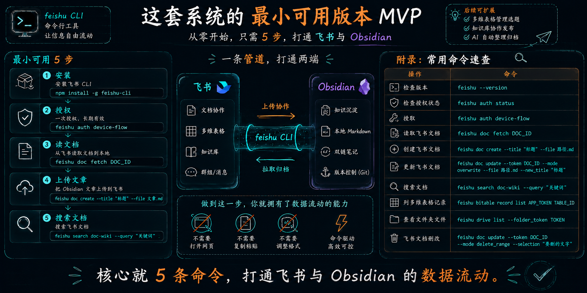

# 飞书+Obsidian完整教程：内容在两个世界自由流动

> 来源：[飞书社区](https://www.feishu.cn/community/prompts?id=7647836423378242771) · [原始 Wiki](https://wcnoxi4wqsvx.feishu.cn/wiki/TotKwmPMiiKroskekHjcdy6UnED)
> 作者：**大象（大象 AI 共学）**
> 同步日期：2026-06-10
> 标签：#工作提效 #AI
> 社区数据：👍 6 · 💬 14 · ⭐ 92 · 🔄 1,569

---

> 预计字数：7000 字  阅读时间：20 分钟  难度等级：⭐⭐（小白友好，按步骤操作即可）

> 核心价值：用飞书 CLI + Obsidian 打通数据双向流动，告别复制粘贴

---


说实话，我被问到最多的问题不是"AI怎么用"，

而是"大象，我的飞书文档和本地笔记能不能打通"。

这个问题的背后，是一个很真实的状态——

你的资料分散在各个地方。

- 飞书有几篇写了一半的文章
- Obsidian 里存了一堆笔记
- 公众号后台躺着草稿
- X 上还有一些随手写的想法。

每个平台都是数据孤岛。

想找一篇半年前写的东西，你得在四个后台翻十分钟。

我不是说要把所有东西都搬到一个地方。

而是说，你应该有一条管道，让数据在这几个世界之间自由流动。

这篇教程讲的就是这件事。

核心是飞书 CLI + Obsidian 的打通方案。

说实话，这不是那种"**装一个插件就搞定**"的事。

它需要你配置一次，但配完之后：

你的飞书文档可以一键拉到 Obsidian，Obsidian 的文章可以一键发到飞书，而且全部带格式。

我花了一个多月才把这套流程跑顺。现在把它写成教程。用起来包爽的。

---



# 先说结论：为什么一定要打通？

飞书和 Obsidian 不是二选一。

它们是两个完全不同的工具，干的活也不一样。

**飞书擅长的事：**

- 多人协作改一篇文章
- 对外分享一篇文档（发个链接就行）
- 用多维表格管理选题、进度、数据
- 用妙记记录会议和访谈

**Obsidian 擅长的事：**

- 长期沉淀你的知识库
- 用本地 Markdown 存储，随时可迁移
- 配合 AI 工具（Codex、Claude Code）进行内容创作
- 版本控制 + GitHub 备份

飞书信噪比高，适合流转和协作。Obsidian 信噪比低，适合沉淀和创作。

所以正确的姿势不是"我只用一个"，而是**飞书负责协作，Obsidian 负责沉淀，中间有一条管道把它们连起来**。

> 🎯 **核心概念：飞书 + Obsidian = 出口 + 底座**

飞书信噪比高，适合流转和协作。

Obsidian 信噪比低，适合沉淀和创作。

飞书 CLI 不是让你二选一，而是在中间搭一条双向管道。

文档拉下来归档，文章发上去协作——全程不需要复制粘贴。

这条管道，就是飞书 CLI。

---

# 第一章：飞书 CLI 到底是什么

飞书 CLI 是一个命令行工具。它的作用很简单：让你用一条命令，直接操作飞书里的东西。

比如：

```bash
# 读取一篇飞书文档的内容
feishu doc fetch FetUdPYCXoAKSmx06rtcZfISn2e

# 把一篇 Markdown 文章上传到飞书
feishu doc create --title "文章标题" --file ./article.md

# 搜索飞书里的某篇文档
feishu search doc-wiki --query "AI Agent"
```

你不用打开飞书网页，不用复制粘贴，不用拖拽上传。一条命令，搞定。

你可以自己手敲这些命令，也可以让 AI（Codex、Claude Code）替你做。后面我会讲具体怎么配合。

现在的版本是 1.0.49。

这很重要——因为网上很多教程写的还是老版本的用法，命令都不一样。

下面全是基于 1.0.49 版本的实测内容。

> 📖 详细介绍可移步阅读：[飞书 CLI - 给自己配个免费秘书](https://wcnoxi4wqsvx.feishu.cn/wiki/OM4cwe8SeiuYtAkVB0ncxT0fnkc)

---



# 第二章：安装和授权

### 安装

安装很简单，一行命令：

```bash
npm install -g feishu-cli
```

装完之后检查一下：

```bash
feishu --version
```

如果显示 `1.0.49`，说明装好了。

> ⚠️ **一个坑**：如果你用的是 macOS 全局 npm 安装（`~/.npm-global/bin/feishu`），每次执行时要用绝对路径或确保 PATH 里有它。有时候 npx 缓存被清理后，`npx feishu` 会报 `could not determine executable`。

所以安装完后最好确认一下：

```bash
which feishu
```

能看到路径就是没问题。

### 授权

这是大多数人觉得麻烦的一步。但其实只要做一次。

```bash
feishu auth device-flow
```

执行后，终端会输出一个链接和一个验证码。类似这样：

```
请访问: https://open.feishu.cn/open-apis/authen/v1/authorize...
验证码: XXXX-XXXX
```

在浏览器打开那个链接，输入验证码。然后在手机飞书里点一下**同意**。

> 📍 **事实：一次授权，长期有效**

飞书现在的 access_token 是 2 小时有效期。

但 CLI 会在 token 过期后自动刷新，你不需要手动处理。

只有 refresh_token 彻底失效（大约 7-30 天）时才需要重新走一次 device-flow。

怎么知道授权状态？

```bash
feishu auth status
```

如果显示已授权，直接干活。如果显示 `needs_refresh`，直接执行操作命令就行，CLI 会自动刷新 token。

搞定。一次授权，后续直接用。

---



# 第三章：核心操作

飞书 CLI 的功能非常丰富。

我挑最常用的几个场景来讲。

### 3.1 从飞书读取文档到本地

这是最常用的操作——把飞书里的一篇文档拉成 Markdown，存到 Obsidian：

```bash
feishu doc fetch FetUdPYCXoAKSmx06rtcZfISn2e
```

执行后终端会输出文档的标题和 Markdown 内容。你可以把它重定向到文件：

```bash
feishu doc fetch FetUdPYCXoAKSmx06rtcZfISn2e > /Users/你的名字/Obsidian/00-收件箱/飞书导入/文档标题.md
```

**文档 ID 从哪找**？飞书文档的 URL 里找。比如：

```
https://xxx.feishu.cn/docx/FetUdPYCXoAKSmx06rtcZfISn2e
```

中间那段 `FetUdPYCXoAKSmx06rtcZfISn2e` 就是 doc_id。

### 3.2 把 Obsidian 文章上传到飞书

反过来，把本地 Markdown 上传到飞书：

```bash
feishu doc create --title "文章标题" --file /Users/你的名字/Obsidian/article.md
```

执行成功后，CLI 会返回 doc_url 和 doc_id。

如果你想把文章上传到飞书某个指定的文件夹（比如你的**内容中心**文件夹）：

```bash
feishu doc create --title "文章标题" --file ./article.md --folder_token UDIafCUA7l1PeVd8FjWc9IBenkV
```

**文件夹 token 从哪找**？你可以在飞书网页端打开目标文件夹，看地址栏里的 `folder/` 后面那串 ID。

上传后飞书会自动把 Markdown 渲染为原生格式——标题、加粗、列表、引用块、代码块都会保持，不需要手动调整。

### 3.3 更新飞书文档

文章更新后，不需要重新创建新文档。用 update 命令：

```bash
feishu doc update --token FetUdPYCXoAKSmx06rtcZfISn2e --mode overwrite --file ./article.md --new_title "新标题"
```

**update 支持 7 种模式**：

| 模式 | 用途 | 示例 |
|------|------|------|
| `overwrite` | 整篇替换 | `--file article.md` |
| `append` | 追加到末尾 | `--content "追加内容"` |
| `replace_range` | 替换指定范围的文本 | `--selection "开头...结尾" --content "新内容"` |
| `replace_all` | 全文替换匹配文本 | `--selection "旧文本" --content "新文本"` |
| `insert_before` | 在匹配文本前插入 | `--selection "锚点文本" --content "新内容"` |
| `insert_after` | 在匹配文本后插入 | `--selection "锚点文本" --content "新内容"` |
| `delete_range` | 删除匹配文本对应的 block | `--selection "要删除的文字"` |

> ⚠️ **重要**：不要对已修改的飞书文档用 overwrite

overwrite 会用本地文件整篇替换飞书文档。

如果飞书文档已经被团队手动修改过，overwrite 会把这些修改全部清掉，且无法通过 CLI 恢复。

飞书有版本历史可以回滚，但操作起来比较麻烦。

**正确做法**：只用 replace_all、insert_before 等精准模式修改。

overwrite 只应该在你确定**本地是唯一源、飞书是空壳**时才使用。

### 3.4 搜索飞书文档

当你记不住文档 ID 时，用搜索：

```bash
feishu search doc-wiki --query "AI Agent" --doc_types DOCX
```

支持按创建者、创建时间、编辑时间筛选。

搜索结果返回文档标题、链接和摘要。

### 3.5 操作飞书多维表格

飞书 CLI 还可以操作多维表格（Bitable）：

```bash
# 查看表格信息
feishu bitable get APP_TOKEN

# 列出所有表
feishu bitable table list APP_TOKEN

# 列出记录
feishu bitable record list APP_TOKEN TABLE_ID

# 创建记录
feishu bitable record create APP_TOKEN TABLE_ID --fields '{"标题": "一篇新文章", "状态": "待处理"}'
```

这对管理选题库、内容日历、学习进度追踪非常有用。

### 3.6 操作飞书知识库

如果你们团队用飞书知识库（Wiki）：

```bash
# 在知识库里创建文档
feishu doc create --title "文章标题" --file ./article.md --wiki_node WIKI_NODE_TOKEN

# 查看知识库空间
feishu wiki space list

# 查看空间下的节点
feishu wiki node list SPACE_ID
```

> ✏️ **实操经验：三个场景覆盖 90% 的需求**
> 我实际用的就是三个场景：
> - 飞书文档拉下来归档（文档→Obsidian）
> - Obsidian 文章发上去协作（文章→飞书）
> - 用多维表格管选题和进度
>
> 没用过第四种场景。这三个已经覆盖了我日常 90% 的数据流动需求。

---



# 第四章：和 Obsidian 配合的工作流

工具讲完了，现在讲工作流。

这是我实际在用的三个场景。

你可以直接照搬。

> 🪄 Obsidian官网一键直达：https://obsidian.md/



### 场景一：飞书文档 → Obsidian 归档

团队在飞书里协作写了一篇文档。

改完定稿后，你需要把它保存到自己的知识库。

**以前的流程：**

1. 打开飞书
2. 找到文档
3. 手动复制全文
4. 在 Obsidian 创建新文件
5. 粘贴
6. 手动调格式（标题层级、列表缩进经常乱）
7. 保存

**一条命令搞定：**

```bash
feishu doc fetch FetUdPYCXoAKSmx06rtcZfISn2e > ~/Obsidian/00-收件箱/飞书导入/方案评审-2026-05.md
```

过程用了 2 秒。格式全部保留。

**进阶用法：** 让 AI 帮你整理。

把文档拉下来之后，让 Codex 或 Claude Code 做三件事：

1. 整理关键信息，去掉会议中的废话
2. 按你的 Obsidian 知识库结构归类
3. 补充链接和上下文

输入命令：

```
请读取刚刚下载的方案评审-2026-05.md
整理为 Obsidian 笔记
保存到：01-项目记录/方案评审/2026-05-评审记录.md
要求：保留原飞书链接；保留原文重点；不要编造来源里没有的内容
```

### 场景二：Obsidian 文章 → 飞书协作

你在 Obsidian 里写了一篇文章的初稿。需要发给团队一起改。

**以前的流程：**

1. 在 Obsidian 里打开 Markdown
2. 复制全部内容
3. 打开飞书
4. 新建文档
5. 粘贴
6. 手动修复格式（飞书粘贴 Markdown 经常分段不对）
7. 复制链接发给团队

**一条命令搞定：**

```bash
feishu doc create --title "AI知识库搭建方案-v1" --file ~/Obsidian/16-课程/AI知识库搭建方案.md
```

返回结果里包含文档链接。直接发到群里。

团队改完之后，你还可以拉回来更新 Obsidian 里的版本：

```bash
feishu doc fetch 返回的doc_id > ~/Obsidian/16-课程/AI知识库搭建方案-v2.md
```

### 场景三：用飞书多维表格管理选题和进度

这是我最喜欢的一个场景。

在飞书里创建一个多维表格，字段包括：

- 选题名称
- 来源（公众号 / 知乎 / X / 社群提问）
- 状态（待写 / 写作中 / 已发布）
- 发布平台
- 截止时间
- 备注

把这个表格作为你的内容管理中心。AI 可以帮你查状态、更新记录、统计进度。

比如用飞书 CLI 查询待写选题：

```bash
feishu bitable record list APP_TOKEN TABLE_ID | grep "待写"
```

或者让 AI 汇总本周要写的文章：

```
请读取飞书多维表格 APP_TOKEN 的内容
筛选出状态为待写且截止时间在本周内的记录
按截止时间排序输出给我
```

---

> 🎯 **方法论：遇到问题先对照坑清单**
> 这 6 个坑都是我自己踩过的。每一个都花过至少半小时排查。你如果在操作过程中遇到报错，先看这一章再问 AI——大概率是其中之一。



# 第五章：这些问题你都能搞定，我说的

我用这半年踩过的坑，整理成清单。你如果遇到同样的问题，直接看这里。

### 坑 1：CLI 返回 fetch failed

**现象**：`feishu doc create` 返回 `{"error": "fetch failed"}`，exit_code=1。

**原因**：飞书 API 服务器偶尔延迟高，导致 CLI 内部 HTTP 请求超时。

**处理**：直接重试。通常第二次就成功。不是认证问题，不需要重新授权。

### 坑 2：npx feishu 报 command not found

**现象**：`npx feishu` 报 `could not determine executable`。

**原因**：npm 缓存被清理了。

**处理**：用全局安装的绝对路径，或者重新 `npm install -g feishu-cli`。

### 坑 3：上传后飞书文档的引用块无法被 CLI 匹配

**现象**：用 `feishu doc update --mode delete_range` 删引用块内容，返回**未找到匹配**。

**原因**：CLI 的定位引擎不搜索引用块（block_type=15）内部文本——它只搜索普通段落和标题。

**处理**：找到引用块前后的**普通段落**作为锚点，或者直接在本地 Markdown 中去掉 `>` 前缀，重新 overwrite 上传。

### 坑 4：update 必须带 --new_title

**现象**：`feishu doc update` 执行成功但飞书文档标题变成了空。

**原因**：每次 `doc update` 都要同步更新文档标题。

**处理**：每次都加上 `--new_title "标题"`。

### 坑 5：上传后的格式有问题（代码块丢失、表格变形）

**现象**：CLI 上传后代码块的缩进乱了，表格变成纯文本。

**原因**：绝大多数情况是 Markdown 源文件格式不规范——比如代码块前后没有空行、表格的对齐符号不标准。

**处理**：检查源文件的 Markdown 格式，确保代码块前后有空行，表格有对齐行。

### 坑 6：一次上传多个文件时被限流

**现象**：连续上传 5-6 篇文档后，CLI 返回限流错误（429）。

**处理**：每上传一个文件，等 2-3 秒再传下一个。

> 🎯 如果你的肉眼无法评判排版或者格式错误，就让你的 AI 来直接帮你排查并修复即可。

---

# 第六章：这套系统的最小可用版本

如果你从零开始，只做下面这些就能用：

1. **安装** `npm install -g feishu-cli`
2. **授权** `feishu auth device-flow`
3. **读一篇飞书文档** `feishu doc fetch DOC_ID`
4. **上传一篇 Obsidian 文章** `feishu doc create --title "标题" --file 文章.md`
5. **搜索** `feishu search doc-wiki --query "关键词"`

做到这一步，你的飞书和 Obsidian 之间就有了一条管道。

不需要打开网页、不需要复制粘贴、不需要手动调整格式。

后续还可以扩展：用多维表格管理选题、用知识库协作发布、用 AI 自动整理归档。

但核心就 5 条命令。



---

## 附录：常用命令速查

| 操作 | 命令 |
|------|------|
| 检查版本 | `feishu --version` |
| 检查授权状态 | `feishu auth status` |
| 授权 | `feishu auth device-flow` |
| 读取飞书文档 | `feishu doc fetch DOC_ID` |
| 创建飞书文档 | `feishu doc create --title "标题" --file 路径.md` |
| 更新飞书文档 | `feishu doc update --token DOC_ID --mode overwrite --file 路径.md --new_title "标题"` |
| 搜索文档 | `feishu search doc-wiki --query "关键词"` |
| 列多维表格记录 | `feishu bitable record list APP_TOKEN TABLE_ID` |
| 查看文件夹文件 | `feishu drive list --folder_token TOKEN` |
| 飞书文档删改 | `feishu doc update --token DOC_ID --mode delete_range --selection "要删的文字"` |

---

# 大象最后的嘚吧嘚：

飞书和 Obsidian 打通之后，你会发现两个以前各自为政的世界开始流动了。

- 团队在飞书写的东西，变成了你知识库里的原材料。
- 你在 Obsidian 沉淀的思考，变成了飞书协作的起点。

**不是工具决定了效率，是工具之间的连接方式决定了效率。这也是 API 和 MCP 最珍贵的地方。**

先去装一个飞书 CLI 吧。

既然看到这里了，如果觉得不错，随手点个赞、在看、转发三连吧，如果可以给我个星标⭐，将不胜感激～谢谢你看我的文章，我们，下次再见。

---

**标签**：#飞书 #Obsidian #数据打通 #CLI #AI工具

**作者**：大象 - 推动 AI 共学，让普通人轻松上手AI

**相关链接**

1. 飞书 CLI（lark-cli）：`npx @larksuite/cli@latest install`
2. Obsidian 官网：https://obsidian.md
3. [Obsidian 数据底座搭建完整教程](https://wcnoxi4wqsvx.feishu.cn/wiki/ASrYw65x4isl7lk1nePcmnE6nzq)
4. [飞书 CLI - 给自己配个免费秘书](https://wcnoxi4wqsvx.feishu.cn/wiki/OM4cwe8SeiuYtAkVB0ncxT0fnkc)

---

> 公众号：大象 AI 共学  个人号：Yishouhundanqu（注明来意）


