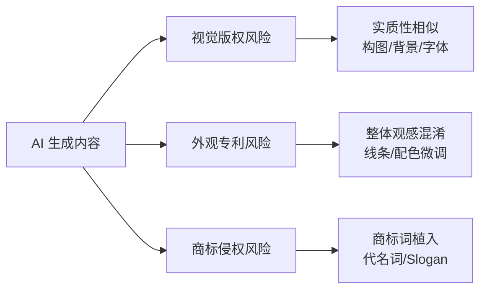

# AI 内容侵权风险与合规

> AI 生成的内容并非"天然安全"——亚马逊已出现因 AI 生成内容导致 Listing 下架的案例。本文档梳理 AI 内容在亚马逊平台上的侵权风险类型、预防策略和应对方案。

---

## 为什么 AI 内容可能侵权

许多卖家误以为"AI 生成 = 全新的 = 安全的"，但实际上：

- AI 训练数据可能包含受版权保护的素材
- AI 可能在不知情的情况下融入他人受保护的构图、轮廓、字体
- AI 为追求通顺可能自动植入他人注册商标
- **平台只看结果是否侵权，不问来源是否为 AI**

---

## 三类主要风险



### 1. 视觉版权 — 实质性相似
**场景**：场景图、A+ 配图、主图背景
**风险点**：AI 重绘但套用了竞品的拍摄创意、背景陈设、未经授权字体
**应对**：上架前做 USPTO/EUIPO 检索排查

### 2. 外观设计专利 — 混淆性
**场景**：产品外观构思、包装设计
**风险点**：对专利爆款微调后，整体视觉仍让消费者混淆
**应对**：明显的改动 + 专利检索

### 3. 商标侵权
**场景**：五点描述、Search Terms、标题、图片文字
**风险点**：AI 自动植入他人注册商标
**应对**：侵权词工具过滤 + 人工复核

---

## 合规检查清单

上架前逐项确认：

### 图片检查
- [ ] 构图是否与竞品**实质性相似**（背景、布局、视角）
- [ ] 使用的**字体**是否有商业授权（不可用网络免费字体）
- [ ] 图片中的**图案元素**是否原创
- [ ] 产品外观是否与他人**设计专利**相似

### 文案检查
- [ ] 标题/五点/描述中是否包含他人**注册商标**词
- [ ] Search Terms 中是否有品牌名
- [ ] Slogan 是否已被他人注册

### 证据存档
- [ ] AI 生成记录（提示词 + 产出截图）
- [ ] 发票（365 天内，数量匹配）
- [ ] 授权书（信息与后台一致）

---

## 被下架后的申诉流程

```
发现 Listing 下架
       ↓
确认违规原因（业绩通知 / 投诉详情）
       ↓
┌── 有合法授权 ──→ 提交授权申诉
└── 确实违规 ──→ 整改内容 → 提交申诉
       ↓
准备证据链：发票 + 授权书 + 整改说明
       ↓
等待审核结果
```

---

## AHA 账户保障计划

| 项目 | 说明 |
|------|------|
| **条件** | 账户状况评级 ≥ 250 分，持续 6 个月 |
| **权益** | 官方专员主动联系 + 72 小时缓冲期 |
| **效果** | 避免 Listing 直接下架或店铺被封 |

---

## 对美工团队的合规要求

结合 [[wiki/workflows/AI驱动美工工作流]]，在设计流程中必须嵌入：

1. **AI 产出后 → 人工合规审查**（新增节点）
   - 检查构图、字体、图案是否涉及他人权益
   - 比对标的知识产权库（逐步积累内部参考库）

2. **素材归档时保留证据链**
   - 保存 AI 提示词 + 原始产出截图
   - 保存字体授权证明
   - 保存产品实拍原图（证明图片基于自有产品生成）

3. **定期更新合规知识**
   - 关注亚马逊政策更新（尤其是 AI 相关内容政策）
   - 定期用专利库检索自查

---

## 参见

- [[wiki/sources/2026-06-10-AI生成内容侵权风险]] — 原始文章摘要
- [[wiki/workflows/AI驱动美工工作流]] — 需要嵌入合规检查的美工工作流
- [[wiki/concepts/AI生成电商主图]]
- [[wiki/concepts/图片管理与LLM配合指南]]
