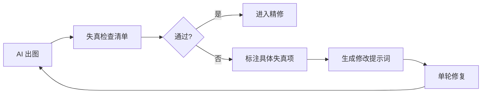

# AI 出图失真防治清单

> AI 生成电商图片时最常见的坑不是"不够好看"，而是**产品失真**——颜色不对、材质改变、配件丢失、文字错乱。本文档总结失真类型、根因和防治策略，每一条都来自实际项目的返工教训。

---

## 常见失真类型

### 1. 颜色失真

| 表现 | 示例 | 严重程度 |
|------|------|----------|
| 产品主色偏移 | 墨绿色变成深蓝色 | 🔴 致命 |
| 配件颜色混淆 | 金色配件变成银色 | 🔴 致命 |
| 饱和度过度提升 | 米黄色变成亮黄色 | 🟡 需修改 |

**根因：** AI 倾向于"美化"颜色，让色彩更饱和、更鲜艳。没有明确色值约束时，模型会按它认为"好看"的方式重新上色。

### 2. 材质改变

| 表现 | 示例 | 严重程度 |
|------|------|----------|
| 塑料变金属/木质 | 白塑料手柄画成木色手柄 | 🔴 致命 |
| 布面变纸面/反之 | 褶皱纸面画成光滑纸面 | 🟡 需修改 |
| 透明材质变实心 | 亚克力画成磨砂白 | 🔴 致命 |

**根因：** AI 训练数据中同品类产品的材质分布与你的实际产品不同。模型会按"统计上最常见"的材质渲染。

### 3. 结构/形状改变

| 表现 | 示例 | 严重程度 |
|------|------|----------|
| 产品部件形状错 | 圆形纸扇变成传统折扇形 | 🔴 致命 |
| 比例失调 | 配件相对于主体过大/过小 | 🔴 致命 |
| 缺少部件 | 绶带消失、气球数量不对 | 🔴 致命 |

**根因：** AI 不"认识"你的产品，只能从提示词中推测形状。只要描述有歧义，模型就会自由发挥。

### 4. 文字/标注错误

| 表现 | 示例 | 严重程度 |
|------|------|----------|
| 少字母/错字母 | `Bride` 写成 `Brid` 或 `Bri de` | 🔴 致命 |
| 字体风格不符 | 花体变印刷体 | 🟡 需修改 |
| 文字位置错误 | 文字压住产品主体 | 🟡 需修改 |

**根因：** AI 图像模型不擅长渲染精确的文字内容，特别是非英语字符或特定造型的文字道具。

### 5. AI "脑补"多余元素

| 表现 | 示例 | 严重程度 |
|------|------|----------|
| 多出配件/装饰 | 产品上多了不存在的螺丝、珠子 | 🔴 致命 |
| 场景出现多余物品 | 背景出现竞品或无关道具 | 🟡 需修改 |
| 模特多出手指/肢体 | 六指、畸形手 | 🟡 需修改 |

**根因：** AI 会主动"丰富"画面使其更美观，但这种丰富在产品还原场景下就是失真。

---

## 防治策略三层体系

### 第一层：提示词约束（预防）

#### 1.1 明确否定式约束

```markdown
## 否定式约束（必须包含）
不要改变产品颜色、材质、形状和结构。
不要添加不存在的配件、装饰和文字。
不要改变产品的实际数量和包装内容。
```

> 负面提示词比正面描述更能限制 AI。说"白色塑料手柄"不如说"不要出现木色、金色、金属手柄"。

#### 1.2 提供精确色值

```markdown
## 颜色约束
产品主色：墨绿色 #2D5A27 / 米黄色 #F5E6CC / 金色 #C9A84C
文字颜色：白色 #FFFFFF
背景颜色：纯白 #FFFFFF
```

> AI 对 HEX 色值的还原度比"深绿色""米黄色"这类模糊描述高得多。

#### 1.3 实拍图参考 + 还原指令

```markdown
## 产品还原指令
完全基于附图中的产品实拍图还原产品外观。
实拍图是唯一的产品外观依据。
参考图仅用于构图和场景参考，不作为产品外观依据。
```

> 这是 [[wiki/workflows/飞书多维表格到AI作图需求流转]] 中定义的"实拍图优先"原则。

#### 1.4 数量清单约束

```markdown
## 数量约束
产品包含清单：
- 纸灯笼：墨绿色 ×1、土金色 ×1
- 纸花：鼠尾草绿 ×3、米黄色 ×2、金色波点 ×2
...（完整列出所有配件和数量）
AI 必须严格按上述清单渲染，不能多不能少。
```

### 第二层：检查清单（检出）

每次 AI 出图后，用以下清单逐项核查：

```markdown
## 产品一致性检查清单

### 颜色检查
- [ ] 产品主色与实物一致（对照色值）
- [ ] 所有配件的颜色与实物一致
- [ ] 背景颜色符合要求
- [ ] 没有过度饱和或褪色

### 材质检查
- [ ] 材质质感与实际产品一致（塑料/纸/布/金属）
- [ ] 表面纹理正确（光滑/磨砂/褶皱）
- [ ] 透明度/反光度符合实物

### 结构检查
- [ ] 产品外形轮廓正确
- [ ] 所有部件都存在（对照清单逐项勾选）
- [ ] 部件之间的比例正确
- [ ] 没有多余/缺失的部件

### 文字检查
- [ ] 所有英文文字拼写正确
- [ ] 文字完整无断字
- [ ] 字体风格符合要求
- [ ] 文字位置合理，不压产品

### 数量检查
- [ ] 每种配件的数量与清单一致
- [ ] 包装内容完整
- [ ] 没有"脑补"出来的额外物品
```

### 第三层：迭代修复（修正）

发现问题后，用"修改提示词模板"而不是重新生成：

```markdown
## 修改提示词
请基于上一版继续修改，不要重新设计整体方向。

保留：
- 产品外形、颜色、结构
- 整体构图和场景

修复：
- [描述具体问题，如：将手柄颜色从木色改为白色塑料]
- [如：将 Bride 的 'e' 补全]
- [如：去掉画面左上角多出的花瓶]
```

> 逐轮修改比重新生成更可控，每次只改一个问题。

---

## 公司实战案例

### 案例 1：782 新娘派对 — `Bride to Be` 字母拉旗

**问题：** AI 反复把 `Bride` 写成 `Brid`（少 e）或 `Bri de`（断字），且 `Be` 后的金色钻戒挂件经常丢失。

**根因：** AI 把字母拉旗当作"装饰图案"处理，而不是需要精确还原的文字道具。

**修复方案：**
1. 在提示词中明确要求"逐字母还原：B-r-i-d-e，不能少字母、不能断字"
2. 补充说明`Be`后必须保留独立钻戒挂件
3. 质检时逐字检查四部分：`Bride` + `to` + `Be` + 钻戒挂件

**沉淀位置：** [[wiki/products/782-新娘派对装饰#字母拉旗专项规则]]

### 案例 2：787 英国纸扇 — 材质混淆

**问题：** AI 把全白塑料手柄画成木色/米金色手柄，把圆形扇面画成传统折叠扇，出现镂空花纹。

**根因：** 训练数据中"纸扇"最常见的是传统日式中式折扇，模型按统计印象渲染。

**修复方案：**
1. 实拍图作为唯一产品外观依据
2. 明确排除项："不要出现木色手柄、镂空花纹、传统折扇骨架"
3. 正向描述："纯白色圆形扇面、白色塑料手柄、白色塑料卡扣"

**沉淀位置：** [[wiki/products/787-英国纸扇]]

---

## 逐轮质检流程



---

## 失真类型优先级

| 优先级 | 类型 | 处理原则 |
|--------|------|----------|
| 🔴 P0 | 颜色、结构、数量失真 | 必须修复，否则不能交付 |
| 🟡 P1 | 材质、文字细节偏差 | 尽量修复，小偏差可精修 |
| 🟢 P2 | 光影、氛围、风格微调 | 美工精修阶段处理 |

---

## 参见

- [[wiki/products/782-新娘派对装饰#字母拉旗专项规则]]
- [[wiki/products/787-英国纸扇]]
- [[wiki/workflows/AI生图提示词模板#实拍文字道具约束]]
- [[wiki/workflows/AI生图提示词模板#亚马逊真实性约束]]
- [[wiki/concepts/提示词工程]]
- [[wiki/workflows/Codex调用GPT作图工作流]]
- [[wiki/standards/设计交付规范]] — 终质检清单
