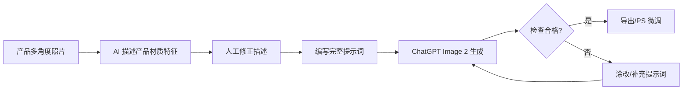

# AI 生成电商主图

> 使用 AI 图像生成工具（如 ChatGPT Image 2 / GPT-4o）快速制作亚马逊产品主图、场景图、A+ 配图的方法论。

---

## 概述

传统的电商主图制作从拍摄到出图需要 2-3 天，高级 A+ 甚至需要一周。AI 生图可以将这个流程缩短到 **3 分钟**，同时绕过摄影棚、相机、模特等物理限制。

## 核心工作流

## 三种出图模式

### 1. 铺货模式（一句话出图）
- 适用：铺货/精铺卖家，对图片精细度要求不高
- 方法：一条提示词包含产品+材质+结构+颜色+尺寸
- 产出：一次性生成 6 张图（主图+场景+细节+卖点）

### 2. 精修模式（提示词 + 线稿）
- 适用：需要提升产品质感
- 提示词精修：通用精修模板 + 材质重点
- 线稿精修：适合布艺产品，用线稿约束形状

### 3. 精品模式（单张精控）
- 适用：精品卖家，需要精确控制每张图的文字、排版、风格
- 方法：提供风格参考 + 排版参考 + 产品参考 + 详细要求
- 特点：一张一张出图，逐一精细调整

## 关键技术

### 竞品反推
将竞品图发给 AI，通过反推版式 Prompt 来复刻优秀设计布局，同时规避侵权风险。重点是反推*版式构图*，而非产品细节。

### PSD 导出
通过提示词要求 AI 分图层导出（商品主体/背景/文字/logo/模特），配合 PS 插件进行后期微调。

### 场景一致性
使用 AI 的全景图功能生成 360° 场景，适用于家具等大件商品的场景图制作。

## 图片检查清单

- [ ] 产品一致性（细节、文字、螺丝、logo）
- [ ] 产品比例合理（提示词中已标注尺寸）
- [ ] 英文拼写正确
- [ ] 无 AI 自行拓展内容
- [ ] 产品颜色准确（如有偏差需 PS 调色）

## AI 生图真实感要点

| 维度 | 关键技巧 |
|------|----------|
| **人物** | 具体化动作、真实皮肤纹理、自然肤色、适度瑕疵 |
| **产品** | 底部接触、自然阴影、表面微细节、不变形 |
| **场景** | 层次感、生活痕迹（褶皱、垂落、水痕等）|

## 局限性

- 颜色控制不够精准（需 PS 后期调色）
- 金属类产品细节不稳定（可能增/减螺丝）
- 非 Plus 会员额度有限

## 参见

- [[wiki/sources/2026-06-09-AI三分钟生成亚马逊主图]]
- [[wiki/concepts/图片管理与LLM配合指南]]
- [[wiki/concepts/提示词工程]]
