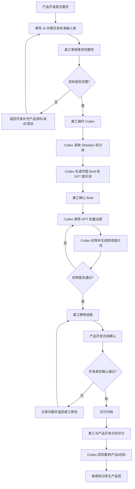

# AI 作图业务流程落地方案

> 本页定义公司内部将 AI 作图纳入亚马逊产品开发与美工交付流程的执行规则。核心目标是让 AI 作图从“单次尝试”变成稳定业务流程：产品开发提交需求，美工审核并操作 Codex，Codex 调用 GPT 出图，美工精修，产品开发做合规确认，通过后交付归档，并把经验回写到 Obsidian 知识库。

## 适用范围

适用于公司亚马逊产品图片生产任务，包括：

- 新 Listing 主图、附图、场景图
- A+ 页面图片
- 广告素材
- 店铺图或品牌图
- 旧图翻新、补图、改版

## 角色职责

| 角色 | 主要职责 | 不应承担 |
|------|----------|----------|
| 产品开发 | 提交作图需求、提供产品资料、确认卖点、最终合规确认、交付验收评分 | 直接跳过需求表让美工口头猜需求 |
| 美工 | 审核需求完整性、操作 Codex、判断视觉方向、精修成稿、提交交付文件 | 代替开发判断产品事实、外观专利和敏感合规风险 |
| Codex | 读取 Obsidian 知识库、整理 Brief、生成 GPT 提示词、初筛图片、记录复盘、更新知识库 | 直接替代人工审美和最终合规判断 |
| GPT 画图 | 批量生成图片方案、根据提示词迭代修改 | 独立决定最终可上架图片 |
| Obsidian 知识库 | 存放规范、模板、案例、产品页、评分和经验复盘 | 只做资料堆放而不更新复用经验 |

## 标准流程



## 阶段规则

### 1. 产品开发提交需求

产品开发必须先填写 [[wiki/templates/AI作图任务标准输入表]]，并提供真实产品资料。

如果该产品已在飞书多维表格 `新品开发总表` 中建档，优先走 [[wiki/workflows/飞书多维表格到AI作图需求流转]]：Codex 先按 `编号` 或 `SKU` 自动读取产品基础信息，再让开发填写 [[wiki/templates/AI作图需求缺口补充表]] 中缺失的图片表达字段。

最低必填：

- 产品名称、ASIN/SKU、所属店铺
- 目标站点和图片用途
- 产品实拍图、精修图或多角度图
- 核心卖点
- 禁止出现元素、禁止词、禁止场景
- 是否涉及儿童、医疗、食品、宠物等敏感场景
- 期望交付日期

### 2. 美工审核需求

美工先审核需求表，不完整时退回产品开发补充。美工不应在资料缺失时直接进入 AI 出图。

审核重点：

- 产品图片是否足够支撑 AI 还原外观
- 卖点是否明确
- 所属店铺是否填写
- 是否有参考案例或模板
- 是否存在明显合规风险

### 3. 美工操作 Codex

美工把需求表交给 Codex，由 Codex 读取：

- [[wiki/standards/亚马逊主图规范]]
- [[wiki/standards/A+页面设计规范]]
- [[wiki/standards/设计交付规范]]
- [[wiki/workflows/Codex调用GPT作图工作流]]
- [[wiki/workflows/AI生图提示词模板]]
- 对应的 `wiki/products/` 产品页
- 类似的 `wiki/cases/` 案例页

Codex 输出：

- 作图 Brief
- GPT 作图提示词
- AI 初筛检查清单
- 修改迭代提示词

### 4. GPT 出图与美工精修

GPT 负责批量生成方案，美工负责筛选、修正和精修。

原则：

- AI 初稿可以多，最终交付必须少而准
- 产品外观、颜色、比例和文字必须人工确认
- 不允许直接把未经精修和合规确认的 AI 图交付给开发

### 5. 产品开发合规确认

开发确认通过后才进入交付归档。开发重点确认：

- 产品结构、颜色、包装内容是否真实
- 卖点表达是否准确
- 图片是否夸大产品功能
- 是否存在竞品构图、商标词、外观专利或敏感场景风险
- 是否符合该产品所在站点和类目的上架要求

## 评分机制

每套图完成后，由美工和产品开发各自评分，总分 5 分。

| 评分人 | 评分维度 | 权重建议 |
|--------|----------|----------|
| 美工 | 视觉质量、产品还原、精修难度、模板复用价值 | 50% |
| 产品开发 | 卖点准确、合规安全、上架可用、业务满意度 | 50% |

### 评分标准

| 分数 | 判定 | 处理方式 |
|------|------|----------|
| 5 分 | 优秀 | 必须沉淀为优秀案例，提炼可复用 prompt、构图或模板 |
| 4-4.9 分 | 可复用优秀经验 | 记录到案例页，提炼至少 1 条经验 |
| 3-3.9 分 | 合格 | 正常归档，可记录小问题 |
| 2-2.9 分 | 需改进 | 必须记录返工原因和改进建议 |
| 1-1.9 分 | 失败案例 | 建议创建失败案例或复盘页 |

> [!important]
> 4 分以上判定为优秀经验，Codex 每周监控时应优先提取这些案例，更新到 `wiki/cases/`、`wiki/products/`、`wiki/templates/` 或 `wiki/workflows/`。

## 每套图归档字段

每个完成案例建议记录以下字段：

```markdown
## 生产记录

- 任务名称：
- 产品名称：
- ASIN / SKU：
- 所属店铺：
- 目标站点：
- 图片类型：
- 提交人：
- 美工负责人：
- 开始日期：
- 交付日期：
- 总耗时：
- AI 出图轮次：
- 返工次数：
- 最终是否通过开发合规确认：是 / 否

## 评分

- 美工评分：/5
- 产品开发评分：/5
- 综合评分：/5
- 是否优秀经验：是 / 否

## 经验复盘

- 做得好的地方：
- 主要返工原因：
- 可复用 prompt：
- 可复用构图/模板：
- 下次避免的问题：
```

## 每周 Codex 监控

建议每周五运行一次 Codex 知识库监控，检查本周 AI 作图生产和经验更新情况。

监控内容：

- 本周完成了几套图
- 本周新增或更新了哪些案例页
- 哪些案例评分达到 4 分以上
- 哪些优秀经验尚未沉淀到模板、产品页或工作流
- 哪些案例低于 3 分，需要复盘
- 是否存在交付完成但未填写评分的案例
- 是否存在开发已确认但未归档的任务
- 是否存在产品页缺失“所属店铺”、视觉策略或 prompt 记录

## 月度指标

当前团队目标：美工每月产出 15 套以上图片。

建议跟踪以下指标：

| 指标 | 目标 | 用途 |
|------|------|------|
| 月完成套图数 | ≥ 15 套 | 衡量产能 |
| 平均单套交付周期 | 持续下降 | 衡量流程效率 |
| AI 初稿可用率 | 逐月提升 | 衡量提示词和知识库质量 |
| 平均返工次数 | 逐月下降 | 衡量需求输入和初筛质量 |
| 4 分以上案例占比 | ≥ 30% 起步 | 衡量优秀经验产出 |
| 评分缺失率 | 0% | 保证复盘数据完整 |
| 每月新增优秀经验数 | ≥ 3 条 | 保证知识库复利 |
| 合规退回次数 | 0 或持续下降 | 保证上架安全 |

## 优秀经验沉淀规则

达到以下任一条件，Codex 应提醒或直接沉淀：

- 综合评分 ≥ 4 分
- 某个 prompt 明显降低返工
- 某个构图适合复用到同店铺同类产品
- 某个合规风险被提前规避
- 某个产品页补充后让后续出图更稳定

沉淀位置：

- 优秀成图与复盘：`wiki/cases/`
- 产品卖点和视觉方向：`wiki/products/`
- 可复用排版：`wiki/templates/`
- 可复用提示词：[[wiki/workflows/AI生图提示词模板]]
- 流程规则变化：`wiki/workflows/`

## 参见

- [[wiki/templates/AI作图任务标准输入表]]
- [[wiki/templates/AI作图需求缺口补充表]]
- [[wiki/workflows/飞书多维表格到AI作图需求流转]]
- [[wiki/workflows/Codex调用GPT作图工作流]]
- [[wiki/workflows/AI驱动美工工作流]]
- [[wiki/workflows/AI生图提示词模板]]
- [[wiki/standards/设计交付规范]]
- [[wiki/concepts/AI内容侵权风险与合规]]
- [[wiki/cases/index]]
- [[wiki/products/index]]
