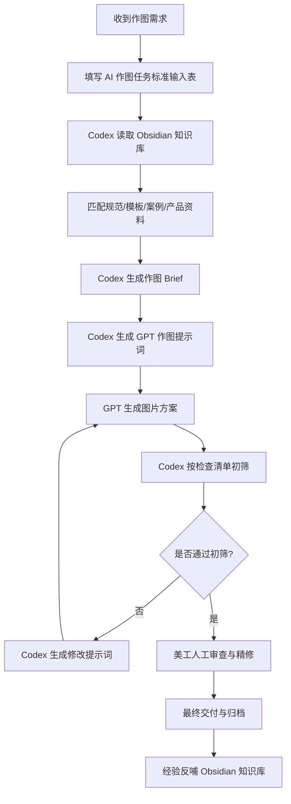

# Codex 调用 GPT 作图工作流

> 本文档定义美工部门使用 **Codex + GPT 画图 + Obsidian 知识库** 的协作方式。核心目标不是让 AI 盲画，而是让 Codex 先读取知识库、整理需求、生成高质量作图 Brief，再调用 GPT 产出图片，由美工完成审美判断、合规检查和细节精修。

## 角色定位

| 角色 | 定位 | 负责内容 |
|------|------|----------|
| Obsidian | 部门知识库 | 存放规范、模板、案例、产品资料、踩坑记录 |
| Codex | 工作流调度员 | 读取知识库、拆解任务、生成提示词、组织文件、记录结果 |
| GPT 画图 | 图像生产工具 | 生成主图、场景图、A+ 图、广告图、改图方案 |
| 美工 | 最终质检负责人 | 审美判断、产品准确性、品牌一致性、合规风险、PS 精修 |

## 总流程



## 阶段一：需求输入

需求方先填写 [[wiki/templates/AI作图任务标准输入表]]。没有标准输入表时，Codex 需要先追问缺失信息，不能直接进入作图。

最低必填信息：

- 产品名称、ASIN 或内部 SKU
- 所属店铺
- 图片类型：主图 / 附图 / A+ / 广告图 / 店铺图
- 目标站点：美国 / 英国 / 德国 / 日本等
- 产品实拍图或精修图
- 核心卖点
- 尺寸、材质、颜色、结构
- 是否有公司模板或参考案例
- 禁止出现的元素

## 阶段二：Codex 读取知识库

Codex 根据需求读取相关页面：

| 信息类型 | 优先读取位置 |
|----------|--------------|
| 亚马逊图片硬性规范 | [[wiki/standards/亚马逊主图规范]]、[[wiki/standards/A+页面设计规范]] |
| 交付和命名标准 | [[wiki/standards/设计交付规范]] |
| AI 出图方法 | [[wiki/concepts/AI生成电商主图]] |
| 合规风险 | [[wiki/concepts/AI内容侵权风险与合规]] |
| 部门工作流 | [[wiki/workflows/AI驱动美工工作流]] |
| 公司模板 | `wiki/templates/` |
| 历史案例 | `wiki/cases/` |
| 产品资料 | `wiki/products/` |

> [!warning] 规则
> Codex 生成提示词前必须先确认：图片类型、目标站点、平台规范、产品真实信息、是否使用模板、是否有合规风险。

## 阶段三：生成作图 Brief

Codex 把散乱需求整理成标准 Brief：

```markdown
## 作图 Brief

- 任务类型：
- 产品：
- ASIN/SKU：
- 所属店铺：
- 目标站点：
- 图片用途：
- 输出尺寸：
- 目标用户：
- 核心卖点：
- 必须展示：
- 禁止出现：
- 参考模板：
- 参考案例：
- 风格方向：
- 合规注意：
- 交付格式：
```

Brief 需要先给美工或负责人确认。确认后，再生成 GPT 作图提示词。

## 阶段四：生成 GPT 作图提示词

提示词应包含 8 个模块：

| 模块 | 内容 |
|------|------|
| 角色 | 让 GPT 扮演资深亚马逊电商视觉设计师 |
| 产品描述 | 材质、颜色、结构、尺寸、真实细节 |
| 店铺风格 | 所属店铺、品牌调性、常用配色、模板偏好 |
| 图片目标 | 主图、场景图、A+ 卖点图、广告图等 |
| 画面构图 | 视角、产品占比、背景、人物、道具 |
| 文案要求 | 英文文案、字体风格、是否允许文字 |
| 平台规范 | 白底、尺寸、无水印、无侵权元素等 |
| 风格要求 | 品牌调性、光影、真实感、质感 |
| 输出要求 | 图片比例、数量、是否需要可编辑分层 |

## 阶段五：GPT 生成与迭代

默认每次生成多方案：

| 图片类型 | 推荐方案数 |
|----------|------------|
| 白底主图 | 2-3 张 |
| 场景图 | 3-5 张 |
| A+ 卖点图 | 每个模块 2-3 张 |
| 广告图 | 3 张以上 |

修改时不要只说“再好看一点”，应转成明确指令：

```markdown
修改目标：
- 保持产品外形不变
- 背景从室内改为户外露营场景
- 减少画面文字，只保留 3 个英文卖点
- 产品占画面 75%
- 移除所有竞品相似道具
```

## 阶段六：Codex 初筛

Codex 对 GPT 输出结果做第一轮检查：

- 是否符合 [[wiki/standards/亚马逊主图规范]]
- 是否符合 [[wiki/standards/A+页面设计规范]]
- 是否有 AI 幻觉：多出的配件、变形结构、错误 Logo
- 产品颜色、材质、比例是否接近实物
- 英文文案是否拼写正确
- 是否存在构图、字体、商标、图案、外观专利风险
- 是否满足交付格式和命名规范

初筛不通过时，Codex 生成修改提示词，让 GPT 继续迭代。

## 阶段七：美工精修

| 工作 | 美工重点 |
|------|----------|
| 颜色校准 | 对照实物或精修图，避免色差 |
| 产品修形 | 修复 AI 变形、边缘、材质错误 |
| 文字排版 | 保证英文准确、层级清晰、可读性强 |
| 品牌一致性 | 检查字体、颜色、Logo、视觉调性 |
| 合规复核 | 检查侵权风险和亚马逊禁止元素 |
| 导出交付 | 按 [[wiki/standards/设计交付规范]] 命名归档 |

## 阶段八：归档与反哺

每次完成任务后，建议归档：

```text
项目文件夹/
├── 需求输入表.md
├── Codex生成Brief.md
├── GPT提示词.md
├── AI初稿/
├── 精修成稿/
├── 交付文件/
└── 复盘记录.md
```

如果某次任务产生了可复用经验，需要沉淀到：

- `wiki/templates/`：新增或更新模板说明
- `wiki/cases/`：新增优秀案例或失败案例
- `wiki/products/`：补充产品视觉卖点
- `wiki/workflows/`：优化流程步骤
- `wiki/standards/`：补充规范或检查项

## 推荐落地顺序

1. 先用 [[wiki/templates/AI作图任务标准输入表]] 规范需求输入
2. 再让 Codex 根据知识库生成 Brief 和 GPT 提示词
3. 美工先手动调用 GPT 出图，验证提示词质量
4. 稳定后，再把常见任务半自动化
5. 每周复盘一次，把好案例和踩坑记录回写知识库

## 参见

- [[wiki/templates/AI作图任务标准输入表]]
- [[wiki/workflows/AI驱动美工工作流]]
- [[wiki/concepts/AI生成电商主图]]
- [[wiki/concepts/AI内容侵权风险与合规]]
- [[wiki/standards/亚马逊主图规范]]
- [[wiki/standards/A+页面设计规范]]
- [[wiki/standards/设计交付规范]]
