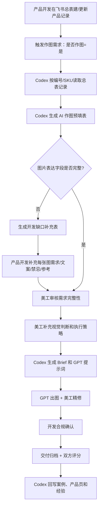

# 飞书多维表格到 AI 作图需求流转

> 本页定义如何把飞书多维表格里的产品基础资料、产品开发提交的图片文档、美工的视觉判断三者合并成 AI 作图任务。原则是：表格已有的信息自动读取，开发只补图片表达缺口，美工只补视觉判断和执行策略。

## 资料来源

| 来源 | 作用 | 维护人 |
|------|------|--------|
| 飞书多维表格 `新品开发总表` | 产品事实来源：编号、SKU、ASIN、站点、品牌、材质、尺寸、包装、参考链接、安审等 | 产品开发 / 运营 / 安审 |
| 产品图片文档 | 图片任务来源：参考图片、每张图要表达什么、摄影要求、美工要求、英文文案和标注 | 产品开发 |
| 产品实拍图文件夹 | 产品真实性来源：真实颜色、材质、结构、数量、包装、配件、可展开/折叠状态 | 产品开发 / 摄影 |
| Obsidian 知识库 | 规范和经验来源：平台规范、案例、产品页、提示词、交付规范 | Codex / 美工 |
| 美工判断 | 执行策略来源：视觉方向、可行性、风险点、AI 出图策略、精修方案 | 美工 |

## 从总表自动读取的字段

以 `新品开发总表` 为主表，优先用 `编号` 或 `上架SKU（父体）` 定位记录。

| 用途 | 飞书字段 |
|------|----------|
| 任务识别 | `编号`、`产品中文名`、`上架SKU（父体）`、`上架ASIN（父体）` |
| 店铺和站点 | `站点`、`品牌`、`产品运营`、`链接负责人` |
| 产品事实 | `产品材质`、`产品做法`、`产品特性`、`下单产品款式` |
| 尺寸重量 | `尺寸（cm inch）`、`重量（g/pound）`、`包装尺寸（inch cm）`、`包装重量` |
| 包装和数量 | `包装`、`外包装做法`、`首批数量` |
| 市场参考 | `产品核心关键词`、`关键词链接`、`参考链接1`、`参考链接2`、`参考图片` |
| 供应链参考 | `供应商链接1`、`供应商链接2`、`供应商价格` |
| 作图状态 | `是否作图`、`是否作A+`、`图片制作`、`作图人员`、`设计人员` |
| 合规基础 | `安审`、`安审人员`、`是否上架`、`上架链接` |

> [!note]
> 表格字段是产品事实来源，但不等于完整作图需求。表格能告诉美工“产品是什么”，不能完整告诉美工“每张图怎么表达”。

## 782 案例观察

本次查看的资料：

- 产品图片文档：`D:\BaiduNetdiskDownload\黑伞美工历史完成图片库\782\782-张苏皖新娘派对装饰产品图片文档 .md`
- 多维表格快照：`D:\BaiduNetdiskDownload\黑伞美工历史完成图片库\782\新品进度总表（更新时间2024.08.11） 副本.base`

对应总表记录：

| 字段 | 读取到的内容 |
|------|--------------|
| 编号 | `782` |
| SKU | `03US-FBA-ZSW-XLH-052` |
| ASIN | `B0GZMW4DNR` |
| 产品中文名 | 新娘派对装饰品 |
| 站点 | US |
| 产品核心关键词 | `bridal shower decorations` |
| 产品材质 | 纸、铝箔、乳橡胶、PVC、网纱布、色丁布、硬卡纸、铝膜等 |
| 产品做法 | 纸灯笼、纸花、纸扇、纸流苏、气球、雨丝帘、头纱、绶带、拉旗、钻石戒指气球等组合套装 |
| 安审 | 未发现商标，可以下单 |
| 是否作图 | 是 |

产品图片文档补充了总表没有的内容：

- 7 张主图/场景图的具体任务
- 每张图的参考样图
- 摄影要求
- 美工要求
- 英文文案和标注
- 场景人物、道具、桌布颜色、构图细节

因此最适合的流程不是让开发重新填一整张作图表，而是让 Codex 从总表预填基础信息，再让开发补充图片表达字段。

## 推荐流转流程

## Word 开发文档处理规则

产品开发提交的图片文档可以是 Markdown、Word（`.docx`）或飞书文档。Word 文档不需要人工复制粘贴给 Codex，Codex 应先自动抽取：

- 正文段落：产品信息、尺寸要求、参考链接、每张图的美工要求
- 嵌入图片：参考图、场景图、素材图
- 图片顺序：按 Word 中出现顺序映射到“样图1、样图2、场景图1”等
- 每张图标题：如“首图（ST）”“尺寸图（CCT）”“细节图（XJT）”“使用图”“场景图”

抽取后，Codex 将 Word 文档内容转换为 [[wiki/templates/AI作图需求缺口补充表]] 的“产品开发补充区”。

> [!important]
> Word 文档不是单纯的图片提取对象。Codex 必须同时读取 Word 里的文字说明和参考图片：文字说明决定“每张图大概要怎么做”，参考图决定“构图/氛围/表达方向”。真正的产品外观必须以产品实拍图文件夹为准。

## 产品实拍图处理规则

### 总则：实拍图采集以实物为准

产品实拍图是 AI 作图**唯一**的产品外观依据。在整个实拍图采集、处理和使用过程中，必须严格以实际产品为准：

1. **采集阶段**：产品开发提供的实拍图必须来自本次实际销售产品本身，不能使用类似款、旧款、样品修改前款式或竞品图替代
2. **核对阶段**：Codex 收到实拍图后，先核对图片中的产品颜色、材质、结构、配件和数量是否与飞书总表一致，如有不符标记为"需开发确认"
3. **使用阶段**：GPT 出图提示词必须要求"按实拍产品还原"，实拍图是唯一产品外观依据，参考图仅用于构图和场景参考
4. **质检阶段**：美工精修和终质检时，每张图都要与实拍图逐项比对，不能以参考图、竞品图或"印象中产品应该长什么样"为标准

AI 作图必须基于实际拍摄的产品图，不能只参考 Word 里的样图或竞品图。

处理顺序：

1. 先从飞书总表读取产品事实
2. 再抽取 Word 文档中的每张图制作说明和参考图
3. 再读取产品实拍图文件夹，识别真实颜色、材质、结构、配件、包装和展开/折叠状态
4. Codex 生成 Brief 时明确区分：
   - `产品事实`：来自飞书总表
   - `制作要求`：来自 Word 文档
   - `产品外观依据`：来自实拍图
   - `参考风格`：来自 Word 里的样图/竞品图
5. GPT 出图提示词必须要求“按实拍产品还原”，参考图只作为构图和场景参考

禁止事项：

- 不允许用 Word 里的参考图替代实拍产品外观
- 不允许为了贴近参考图而改变产品颜色、材质、结构、花纹、数量、包装内容
- 不允许忽略实拍图中的瑕疵/结构差异，直接生成一个“看起来更高级但不是本产品”的款式
- 不允许在尺寸图、数量图、细节图中凭参考图补不存在的配件

### 787 Word 文档观察

本次查看的开发文档：

- `C:\Users\Q\Downloads\787-英国纸扇-范晓云 (5).docx`

文档结构：

| 项目 | 内容 |
|------|------|
| 产品信息 | 英国纸扇 |
| 尺寸要求 | 1600 |
| 优质卖家参考链接 | `https://www.amazon.co.uk/dp/B0CBWYVK14` |
| 嵌入图片 | 7 张 |
| 图片任务 | 首图、尺寸图、细节图、使用图、场景图 1、场景图 2、场景图 3 |

从飞书总表读取到的 787 产品事实：

| 字段 | 内容 |
|------|------|
| 编号 | `787` |
| SKU | `05US-FBA-FXY-XLH-002` |
| ASIN | `B0GZNX63CF` |
| 产品中文名 | 婚礼装饰用折叠纸扇 |
| 站点 | UK |
| 品牌 | UK-Aruatu |
| 产品核心关键词 | `Paper fans for wedding decoration` |
| 产品材质 | 纸，塑料 |
| 产品做法 | 80pcs |
| 安审 | 目前专利未交费失效状态，暂时可以下单，开发自己时刻查一下 `GB6039469S` |

Word 文档补充了飞书总表没有的图片表达信息：

- 首图：展示 80pcs 数量、展开折扇和折叠扇柄配件
- 尺寸图：标注展开尺寸 `23cm/9in × 26cm/10.2in`，折叠后尺寸 `14cm/5.7in × 2cm/0.8in`
- 细节图：展示开合结构、纸质扇面、塑料手柄和固定卡扣
- 使用图：四步操作说明 `How to use`
- 场景图：户外婚礼、婚礼椅装饰、餐桌/伴手礼、新娘伴娘手持折扇

787 产品实拍图文件夹：

- 旧路径：`C:\Users\Q\Downloads\新建文件夹`（已确认传错产品，不再作为 787 作图依据）
- 新路径：`C:\Users\Q\Downloads\新建文件夹\新建文件夹`

实拍图观察：

- 新实拍图共 11 张产品素材：8 张 JPG、3 张 PNG
- 覆盖白色折叠状态、白色塑料手柄/卡扣、手持半展开、完全展开状态
- 真实产品特征：全白圆形折叠纸扇、白色褶皱扇面、白色塑料手柄、白色塑料锁扣/卡扣，无木色扇骨、无米金色手柄、无镂空花纹
- 后续 AI 作图时，所有主图、尺寸图、细节图和场景图中的折扇外观都应以新路径实拍图为准

> [!important]
> Word 文档里的场景和文字可以进入 AI 作图 Brief，但产品事实仍以飞书总表为准。如果 Word 和总表冲突，优先标记为“需开发确认”，不能让 AI 自行判断。

## 开发只需要补充的字段

开发补充应聚焦“图片怎么表达”，不要重复填写总表已有的产品事实。

| 字段 | 为什么需要开发补 |
|------|------------------|
| 图片清单 | 总表只知道是否作图，不知道要几张图、每张图用途 |
| 每张图目标 | AI 和美工需要知道这张图要卖什么点 |
| 参考样图和竞品链接 | 决定构图方向，也用于合规相似性判断 |
| 摄影要求 | 哪些角度、组件、道具必须拍到 |
| 英文文案和标注 | 避免 AI/美工临时猜文案 |
| 禁止出现元素 | 降低返工和合规风险 |
| 敏感合规说明 | 儿童、医疗、食品、宠物、版权图案、商标词等 |
| 交付优先级和日期 | 用于排产 |

## 美工需要补充和判断的字段

| 字段 | 判断内容 |
|------|----------|
| 视觉方向 | 白底、信息图、生活方式场景、A+ 风格 |
| 参考图可复用程度 | 参考构图是否能借鉴，是否有侵权相似风险 |
| AI 出图方式 | 直接生成、垫图改图、局部重绘、先出背景再合成 |
| 精修难点 | 产品变形、材质、颜色、文字、人物、复杂配件 |
| Prompt 策略 | 正向提示词、禁止项、产品一致性约束 |
| 预计返工风险 | 哪些图最容易出错 |
| 是否进入 AI 作图 | 个别任务可能更适合直接 PS 或实拍 |

## 自动化读取方案

### 方案 A：读取飞书在线 Base

适合日常正式流程。Codex 通过 `lark-cli base` 读取在线多维表格：

1. 按 Base 名称或链接定位 `新品开发总表`
2. 按 `编号` 或 `上架SKU（父体）` 搜索记录
3. 读取字段结构和记录内容
4. 生成预填表
5. 对缺失字段生成开发补充问题

优点：数据最新，适合长期流程。

### 方案 B：读取本地 `.base` 快照

适合历史资料摄入和离线复盘。Codex 可解压 `.base` 的 `gzipSnapshot`，读取表结构和记录。

优点：不依赖在线权限，适合把历史案例批量整理进 Obsidian。

限制：快照不是实时数据，不能作为最新生产状态。

## 预填与补充规则

| 信息类型 | 处理方式 |
|----------|----------|
| 总表已有且可信 | 自动预填，开发不用重复写 |
| 总表为空但作图必需 | 进入开发缺口补充表 |
| 总表和图片文档冲突 | 标记为冲突，要求开发确认 |
| 视觉执行类字段 | 美工补充 |
| 合规最终判断 | 产品开发确认，美工辅助发现风险 |

## 与现有流程的关系

本流程是 [[wiki/workflows/AI作图业务流程落地方案]] 的“需求接入增强版”：

- 原流程定义责任链
- 本流程定义如何从飞书总表和开发文档自动拼出作图需求
- [[wiki/templates/AI作图需求缺口补充表]] 用于开发补齐总表没有的信息
- [[wiki/templates/AI作图任务标准输入表]] 可作为完整任务表，但日常生产优先使用“自动预填 + 缺口补充”

## 参见

- [[wiki/workflows/AI作图业务流程落地方案]]
- [[wiki/templates/AI作图需求缺口补充表]]
- [[wiki/templates/AI作图任务标准输入表]]
- [[wiki/workflows/Codex调用GPT作图工作流]]
- [[wiki/standards/设计交付规范]]
